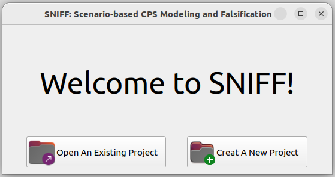
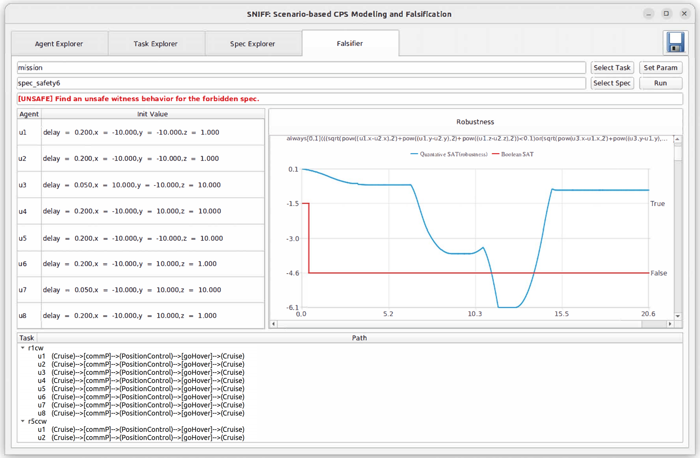

# SNIFF: Scenario-based Flexible Modeling and Scalable Falsification for Reconfigurable CPSs
## Overview
SNIFF is a scenario-based ***modeling*** and ***falsification*** tool for ***reconfigurable CPSs***.
It supports:

- `hierarchical modeling for reconfigurable CPS`:
  providing template models for agent inherent features, together with an instantiation mechanism to activate single agent's runtime behavior, communication configurations for multiple agents' connected behaviors, and scenario task configurations for their dynamic topologies.

- `temporal logic falsification for reconfigurable CPS`:
  employing classification-model-based optimization to explore search space effectively and cut unnecessary system simulations and robustness calculations for efficiency.


## Installation
Dependencies:
- Operating System: Ubuntu Desktop >== 22.04.3 LTS

>SNIFF can be directly installed and run on Ubuntu Desktop 22.04.3 LTS.
>
>Other environments may also work, but compatibility with other environments is not guaranteed.

To download our tool, clone the entire repository into a directory (named DIR, the same as below) in your system.

    git clone https://github.com/njuwjw/SNIFF.git


## Running SNIFF
You can run the below commands to execute SNIFF:

```sh
cd DIR/SNIFFtool
export LD_LIBRARY_PATH=./lib:LD_LIBRARY_PATH.
sudo chmod +x sniff
./sniff
```

Try demos in the `examples/` folder or create a project yourself.



We display the primary graphical user interfaces of **"SNIFF"** to illustrate how to model and falsify a reconfigurable CPS by it.

In **"Agent Explorer"**, as shown in the figure below, agents in the CPS can be created in the Agent Browser on the left, with unique IDs and types. Agent types can be selected from any template-HA model created in the Model Browser above. These template models can be viewed and modified visually on the right.


In **"Task Explorer"**, as shown in the following picture, scenario tasks for the CPS can be created and organized hierarchically in the Task Tree on the left. Each atom task in the tree can be edited visually on the right. Specifically, agent instantiations can be edited in the Transition Activations tab, with inactivated global transitions shown in dotted arrows. Agent communication configurations can be edited in the Communication Configurations tab, with synchronized transitions highlighted in the same color. Note that synchronized transitions are automatically activated in this tool for convenience.


In **"Spec Explorer"**, as shown in the next figure, system specifications can be created and edited using our topology-related STL. 


Then, for the CPS running in any created scenario task, these system specifications can be falsified in **"Falsifier"**, as shown in the last figure. Once it finds a witness system behavior that violates the selected specification, its corresponding path, values of unknown variables and external inputs, along with the robustness signals of the specification's subformulas, will be displayed below.




## Structures

```
SNIFF
├── SNIFFtool
│      ├── lib
│      ├── platforms
│      └── SNIFF
├── examples
│      ├── uav
│      │     ├── models
│      │     ├── tasks
│      │     └── specs
│      └── carAssembly
│            ├── models
│            ├── tasks
│            └── specs
├── experiments
│
├── README
└── README.source
```
- `SNIFFtool `: Tool's executable file and dependency libraries
- `examples `: Demos of a Multi-UAV example system and a automatic assembly system

